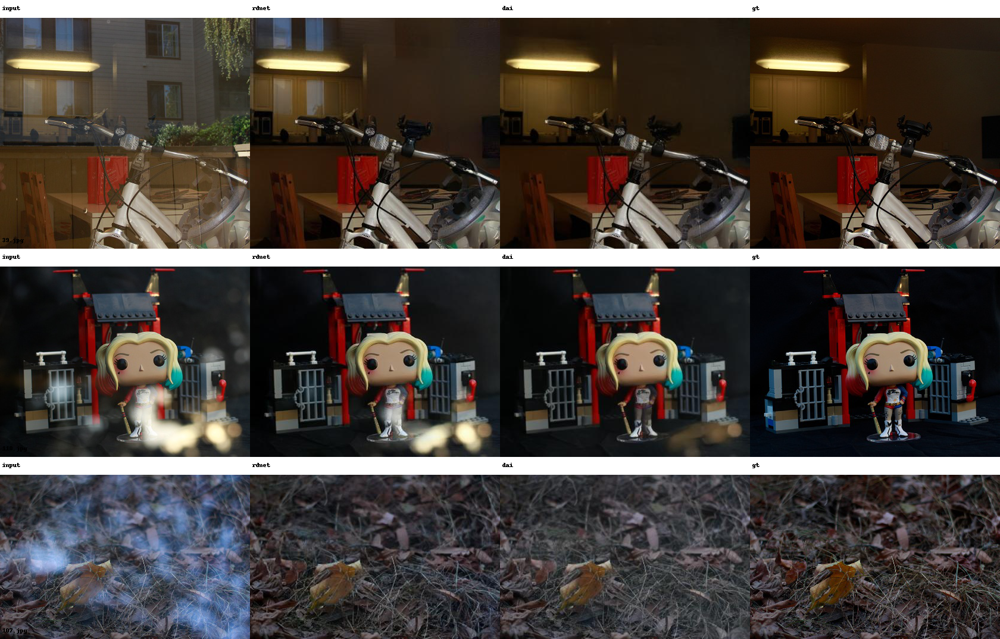
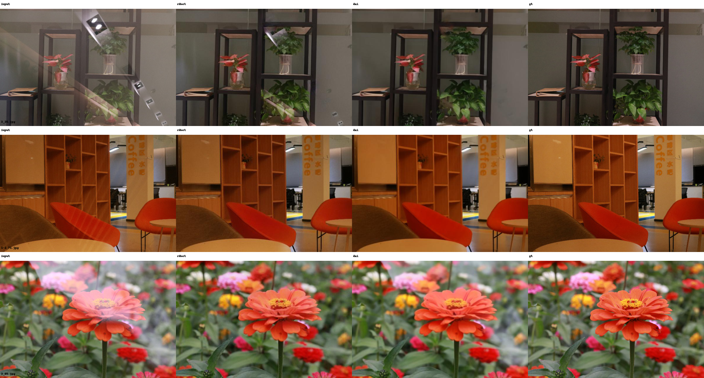
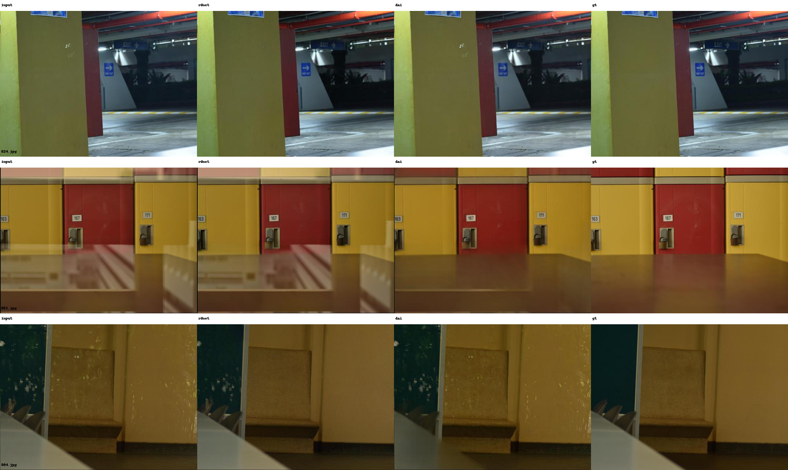
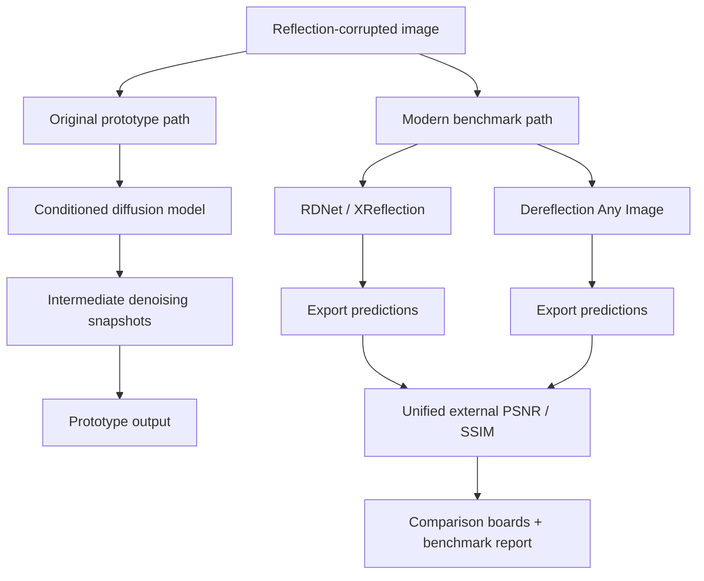

# Single-Image Reflection Removal Playground

> An evolving research workspace for **single-image reflection removal**:
> an older conditioned diffusion prototype, plus modern benchmarking/reference utilities
> for stronger baselines.

The repository slug is still `diffusion-reflection-removal`, but the project is now better thought of as a **reflection-removal playground** rather than a single frozen model implementation.

---

## TL;DR

- **Original core**: a paired-supervision, conditioned diffusion prototype for reflection removal
- **Newer layer**: scripts/configs/docs for benchmarking against stronger modern methods
- **Best use today**: compare new ideas against **RDNet / XReflection** and **Dereflection Any Image**
- **If you want quality first**: treat the old diffusion model as historical context, not the default strongest baseline

---

## Sample output

Top-of-page example from the benchmarked workflow:

`input → RDNet → Dereflection Any Image → GT`



If you want the original prototype-only artifact trail, the `output/` directory still contains
its intermediate denoising snapshots and final sample output.

---

## Visual benchmark examples

Below are targeted side-by-side boards from the 2026 benchmark run.

Each row compares:

`input → RDNet → Dereflection Any Image → GT`

### Real20


### Nature



### SIR2-Wild



---

## What this repo is now

This repository has **two layers**:

### 1) Original prototype

An early reflection-removal model built around:

- a **UNet-style backbone**
- a **1000-step conditioned diffusion process**
- paired reflection / reflection-free supervision
- progressive denoising snapshots during inference

### 2) Benchmark + reference layer

A lightweight evaluation layer for comparing this prototype against stronger public references:

- **RDNet / XReflection**
- **Dereflection Any Image**

This makes the repo useful both as:

- a record of an older diffusion approach, and
- a launch point for more realistic next experiments

---

## Workflow / pipeline comparison



In practice:

- the **left branch** is the original experiment,
- the **right branch** is the newer “don’t guess, benchmark it” workflow.

---

## Benchmark snapshot

Public benchmark run on `Real20`, `Nature`, and `SIR2-Wild` (95 images total).

| Dataset | Count | RDNet PSNR | RDNet SSIM | DAI PSNR | DAI SSIM | Δ PSNR |
| --- | ---: | ---: | ---: | ---: | ---: | ---: |
| Real20 | 20 | 24.1751 | 0.8189 | **25.2353** | **0.8367** | **+1.0601** |
| Nature | 20 | 26.3320 | 0.8367 | **27.0547** | **0.8421** | **+0.7227** |
| SIR2-Wild | 55 | 27.1827 | 0.9083 | **27.5731** | **0.9192** | **+0.3904** |

Weighted overall:

- **RDNet**: PSNR `26.3704`, SSIM `0.8744`
- **DAI**: PSNR `26.9718`, SSIM `0.8856`

See:

- [`docs/benchmarks/2026-04-17-benchmark-report.md`](docs/benchmarks/2026-04-17-benchmark-report.md)
- [`docs/benchmarks/2026-04-17-rdnet-summary.json`](docs/benchmarks/2026-04-17-rdnet-summary.json)
- [`docs/benchmarks/2026-04-17-dai-summary.json`](docs/benchmarks/2026-04-17-dai-summary.json)

---

## Repository layout

```text
.
├── config.py                         # original prototype config
├── train.py                          # original prototype training entrypoint
├── inference.py                      # original prototype inference entrypoint
├── models/
│   ├── diffusion.py
│   └── swin_transformer.py
├── utils/
│   ├── dataset.py
│   └── training.py
├── configs/
│   └── rdnet_eval.yml                # XReflection RDNet test-only config
├── scripts/
│   ├── run_dai_eval.py               # external evaluator for Dereflection Any Image
│   ├── collect_rdnet_results.py      # export + score XReflection outputs
│   └── make_method_comparison.py     # build side-by-side boards
├── docs/
│   ├── latest-methods.md
│   └── benchmarks/
│       ├── 2026-04-17-benchmark-report.md
│       ├── 2026-04-17-rdnet-summary.json
│       └── 2026-04-17-dai-summary.json
└── output/
    └── sample prototype inference artifacts
```

---

## Quick start

### Environment

```bash
conda create -n reflection python=3.8
conda activate reflection
pip install -r requirements.txt
```

---

## Original prototype

### Training

```bash
python train.py --batch-size 4 --epochs 100 --lr 2e-4
```

### Inference

```bash
python inference.py \
  --input path/to/input/image.jpg \
  --output_dir ./outputs/sample1 \
  --checkpoint path/to/checkpoint.pth \
  --save_interval 50
```

### Main inference arguments

- `--input` — input image with reflections
- `--output_dir` — directory for final + intermediate outputs
- `--checkpoint` — trained checkpoint path
- `--save_interval` — save denoising snapshots every *N* steps

### Prototype outputs

1. input image
2. initial noise image
3. intermediate denoising snapshots
4. final reflection-removed image

---

## Stronger baseline / reference evaluation

The files under `scripts/` and `configs/` are meant to be used **alongside upstream repos**, not as a full in-repo reimplementation.

### RDNet / XReflection

Use:

- `configs/rdnet_eval.yml`
- `scripts/collect_rdnet_results.py`
- `scripts/make_method_comparison.py`

Typical flow:

1. run XReflection in `test_only` mode with an RDNet checkpoint
2. export latest clean predictions from XReflection visualization folders
3. rescore externally on the public test set

### Dereflection Any Image

Use:

- `scripts/run_dai_eval.py`

Typical flow:

1. point the script at a local clone of `Dereflection-Any-Image`
2. run inference on public test subsets
3. save predictions, concat boards, and JSON metrics

---

## Recommended next direction

If you are continuing this project in 2026-style terms:

### Good default path

- benchmark against **RDNet / XReflection**
- benchmark against **Dereflection Any Image**
- only then decide whether a new idea beats either of them

### If you want to keep the diffusion angle

Prefer:

- stronger priors,
- faster inference,
- better conditioning/control,
- explicit benchmarking against public sets,

instead of continuing the old prototype blindly.

See [`docs/latest-methods.md`](docs/latest-methods.md).

---

## Current limitations

- The original diffusion model is an **older research prototype**
- No pretrained checkpoint for the prototype is bundled here
- The benchmark scripts depend on **external upstream repos** and public dataset layouts
- GPU-oriented usage is still the intended path
- CUDA / PyTorch compatibility should be verified manually per environment

---

## Why keep the old prototype at all?

Because it is still useful as:

- a readable baseline for older conditioned diffusion design choices,
- a record of previous experimentation,
- a comparison point for how much newer methods have improved

This repo is intentionally positioned to preserve that context while making future work more grounded.

---

## License

Apache License 2.0. See [`LICENSE`](LICENSE).
