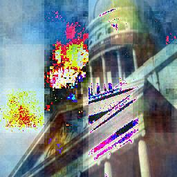

# Diffusion Reflection Removal

PyTorch implementation of single-image reflection removal using a conditioned diffusion model.

## Status

This repository is best understood as a **research prototype**. It documents the current model structure, training loop, and inference flow, but it is not packaged as a benchmark suite or production-ready toolkit.

## Sample Output

| Input | Final output |
|---|---|
|  |  |

The `output/` directory also contains intermediate denoising snapshots produced during inference.

## Model Summary

The implementation combines:

1. **UNet-style backbone**
   - hidden dimension starts at 96
   - progressive channel expansion: `96 → 192 → 384 → 768`
   - encoder / decoder skip connections

2. **Conditioned diffusion process**
   - 1000 diffusion timesteps
   - linear beta schedule
   - image-conditioned denoising

3. **Progressive reconstruction outputs**
   - intermediate samples can be written during inference to visualize denoising behavior

## Repository Layout

```text
.
├── config.py
├── train.py
├── inference.py
├── models/
│   ├── diffusion.py
│   └── swin_transformer.py
├── utils/
│   ├── dataset.py
│   └── training.py
└── output/
    └── sample inference artifacts
```

## Setup

```bash
conda create -n reflection python=3.8
conda activate reflection
pip install -r requirements.txt
```

## Training

```bash
python train.py --batch-size 4 --epochs 100 --lr 2e-4
```

Training details live in `train.py` and use paired reflection / reflection-free supervision.

## Inference

```bash
python inference.py \
  --input path/to/input/image.jpg \
  --output_dir ./outputs/sample1 \
  --checkpoint path/to/checkpoint.pth \
  --save_interval 50
```

### Main arguments

- `--input` — input image with reflections
- `--output_dir` — directory for final and intermediate outputs
- `--checkpoint` — trained checkpoint path
- `--save_interval` — save intermediate denoising results every *N* steps

## Inference outputs

1. input image
2. initial noise image
3. intermediate denoising snapshots
4. final reflection-removed image

## Notes and limitations

- CPU and GPU inference are both supported, but intended usage is GPU-oriented.
- No pretrained checkpoint is bundled in this repository.
- CUDA / PyTorch compatibility should be checked manually for GPU runs.
## License

Apache License 2.0. See [`LICENSE`](LICENSE).
